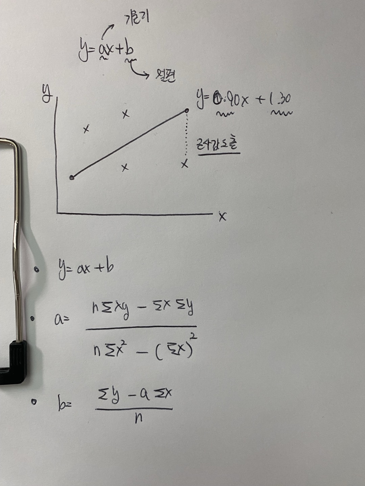

# 머신러닝 개념 이해

## 머신러닝이란?

- 머신러닝 vs 통계 vs 딥러닝
- 지도학습 vs 비지도학습

## 머신러닝 개념

- 머신러닝(Machine Learning)은 데이터를 바탕으로 패턴을 학습하고, 이를 기반으로 예측이나 분류를 수행하는 알고리즘을 의미해. 사람이 일일이 명령어를 작성하는 것이 아니라, 모델이 데이터를 통해 스스로 규칙을 찾아내는 방식이야.

## 머신러닝 vs 통계 vs 딥러닝

- 통계학: 데이터의 관계를 분석하고 해석하는 학문. (ex. 평균, 분산, 회귀 분석)
- 머신러닝: 데이터에서 패턴을 학습해 예측하는 알고리즘. (ex. 선형 회귀, 의사결정나무)
- 딥러닝: 신경망을 기반으로 한 머신러닝의 하위 분야. (ex. CNN, RNN)
- 지도학습 vs 비지도학습

  - 지도학습(Supervised Learning): 입력과 정답(출력) 데이터가 있는 상태에서 학습하는 방식.

  - 예) 이메일이 스팸인지 아닌지 분류하는 모델 (입력: 이메일 내용, 정답: 스팸/비스팸)
    대표적인 알고리즘: 선형 회귀, 로지스틱 회귀, KNN, 의사결정나무
    비지도학습(Unsupervised Learning): 정답이 없이 데이터의 패턴을 학습하는 방식.

  - 예) 고객 데이터를 군집화해서 그룹을 나누는 모델
    대표적인 알고리즘: K-Means, PCA(주성분 분석)

## 머신러닝 알고리즘

### 선형회귀 알고리즘

1. y=ax + b를 구하고
2. 입력값에 따라서 근사값을 추출

[선형회귀방식을 활용한 근사값 찾기](linear.go)

